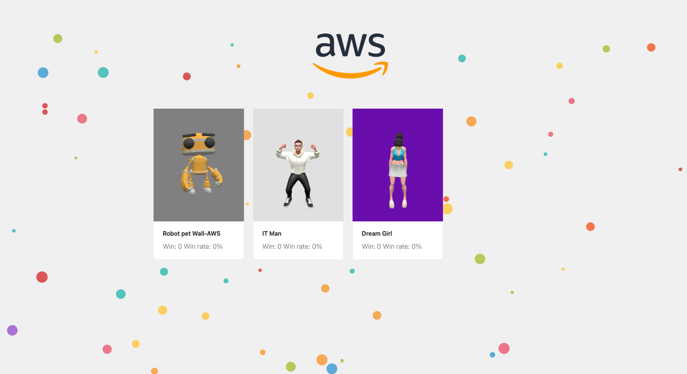

<div align="center">

  
# Game 3D model NPC Experiment Project
This repository contains the code for a voice-controlled 3D game built on AWS cloud services. The game allows players to interact with non-player characters (NPCs) and chat with them using voice commands.

[**English**](./README.md) | [**中文简体**](./README_zh_CN.md)

[](./LICENSE)

</div>

## Security

See [CONTRIBUTING](CONTRIBUTING.md#security-issue-notifications) for more information.


## Project Structure

```
├── chat-app  // This directory contains the backend code for the application.
│   ├── assets
│   ├── chat
│   │   └── prompts
│   ├── events
│   ├── layers
│   │   ├── boto3-layer
│   │   ├── sagemaker-layer
│   │   └── scipy-layer
│   ├── tests
│   │   ├── integration
│   │   └── unit
│   ├── ttsAsync
│   └── wav2mp3Func
├── front-end  // This directory contains the frontend code for the application.
│   ├── app    // Pages
│   │   ├── chat-page
│   │   └── npc-list
│   ├── components  // UI Components & Model show
│   │   ├── animation-skinning-morph  // Robot component
│   │   ├── chat-component  // Chat input and audio component
│   │   ├── dream-girl  // Girl component
│   │   ├── mum   // Mum component
│   │   └── richard  // IT man component
│   ├── pages  // Nextjs API（Backend-for-Frontend）
│   │   └── api
│   ├── public  // images & glb file
│   │   └── models
│   ├── service  // Backend-for-Frontend to back-end 
│   ├── tempAudio  // Temp audio data
│   └── tools
└── images   // Readme images
```

The project is divided into three main directories:

1. /chat-app: This directory contains the backend code for the application.
2. /front-end: This directory contains the frontend code for the application.
3. /notebooks: This directory contains Jupyter notebooks for deploying the Bark and Whisper models used in the application.

## Prerequisites

Before running the application, ensure that you have the following prerequisites installed:

* Python (version 3.9 or higher)
* AWS CLI (configured with your AWS credentials)
* Service Application Model(SAM cli) >= 1.118.0

## Project Architecture


## Usage
1. Clone the repository:
```
git clone https://github.com/RichardLeeY/3DNPC.git
```
### Back-end
2. Deploy backend serverless rest api
```
cd chat-app
sam sync --watch --stack-name chat-app
```
In about 5 minutes,when the stack deployment accomplished . You can get API key and API gateway endpoint from the cloudformation stack outputs tab. Copy the api key value. You will use it in following steps.

3. Prepare generative AI inference endpoint
    - Deploy open source ASR model Wisper from Sagemaker Studio JumpStart, It will cost about 5-10 minutes to finish deployment. When the SageMaker Endpoint is ready. Open the Lambda Console , find the <font color=#008000>chat-app-ChatFunction-XXX</font>  lambda function and add Environment variables , The key is "ASR_SAGEMAKER_ENDPOINT", The value is the sagemaker endpoint that you get from this step.
    - (Option) If you want to implement TTS for Chinese Language. Follow step to deploy Bark-small model with Sagemaker notebook instance. It will also cost about 5-10 minutes to finish. When the sagemaker endpoint is ready. Open the lambda Console , find the <font color=#008000>chat-app-TtsAsyncFunction-XXX</font>  lambda function and add Environment variables, The key is "TTS_SAGEMAKER_ENDPOINT". The value is the sagemaker endpoint that you get from this step.


### Front-end
4. Edit the front-end .env file, set the "random authentication key" and backend serverless rest api host/key in the .env file.
```
cd front-end
vim .env
```
NEXT_PUBLIC_API_KEY="random authentication key"
API_KEY="random authentication key"
API_GATEWAY_URL="backend serverless rest api host"
API_GATEWAY_KEY="backend serverless rest api key"

5. Deploy front-end service

Maybe you need to install PM2 on your server for process hosting.
```
cd front-end
npm install # install dependencies
npm run build
npm run dev # local debug
npm run start # start service in current command line
sudo pm2 start npm -- start # start service by pm2
```

## Snapshot


## Acknowledgments

### AWS services
This project was made possible with the help of the following AWS services:
- Amazon Polly
- Amazon Bedrock Claude Haiku
- Amazon SageMaker Endpoint
- Amazon Lambda
- Amazon API Gateway
- Amazon EC2
  
### UI & Threejs & Audio

The front-end project uses Threejs to render various models. The model files (glb) are in the public folder of the front-end directory. See: https://threejs.org/examples/#webgl_animation_skinning_morph.

All background information/action binding is implemented in the front-end/components/chat-component/index.tsx file.

The recording function uses the browser `navigator.mediaDevices` API. This API needs to be accessed on an HTTPS site by default. Otherwise, you need to manually set the security settings of this site. Reference: https://developer.mozilla.org/en-US/docs/Web/API/MediaDevices/getUserMedia

Audio playback requires that the S3 storage for audio be allowed to allow CORS. It is recommended to add Cloudfront back to the S3 source. After configuration, you can use the `<audio src=""/>` tag to play.audio

See: https://docs.aws.amazon.com/AmazonS3/latest/userguide/cors.html  

https://docs.aws.amazon.com/AmazonS3/latest/userguide/ManageCorsUsing.html  

#### How to add GLB model in the UI components?
See `front-end/components/animation-skinning-morph/index.tsx`

```typescript
// Init model
const initScene = () => {
    // ...
	// Set camera
    camera = new THREE.PerspectiveCamera(45, hightWidghtSet, 0.25, 100);
    camera.position.set(-3, 3, 10);
    camera.lookAt(0, 2, 0);
    // Set background
    scene = new THREE.Scene();
    const textureLoader = new THREE.TextureLoader();
    const backgroundTexture = textureLoader.load("20240509-162640.jpeg");
    scene.background = backgroundTexture;
    // ...
		// Add glb model
    const loader = new GLTFLoader();
    loader.load(
      "/models/RobotExpressive.glb",
      (gltf) => {
        model = gltf.scene;
        scene.add(model);
        !isShowList && createGUI(model, gltf.animations);
      },
      undefined,
      (e) => {
        console.error(e);
      }
    );
		// ...
  };

	// Create action menu
  const createGUI = (model: any, animations: string | any[]) => {}

```

## Dependencies

### Front-end
- Next.js（ https://github.com/vercel/next.js ）
- ant-design（ https://github.com/ant-design/ant-design ）
- Three.js（ https://threejs.org/ ）

### Back-end
