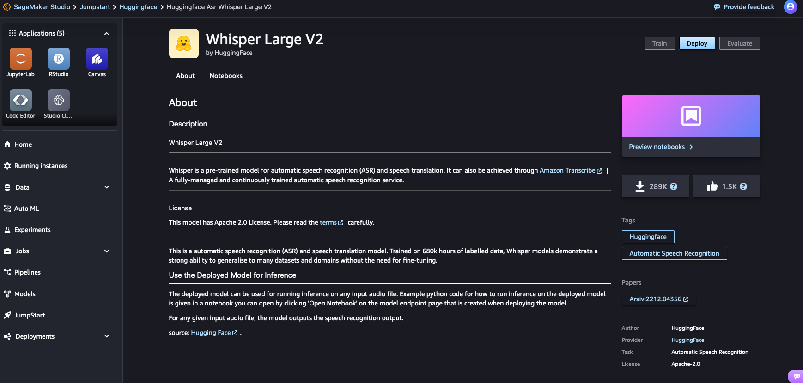

## TTS and ASR Model deployment Guide
Generative AI is developing rapidly, and the corresponding TTS (Text-to-Speech) and ASR (Automatic Speech Recognition) models are also continuously evolving. In this AI game development, we have chosen the open-source Whisper ASR model and the SunO/bark TTS model. Here's an introduction on how to quickly deploy them on Amazon SageMaker
### Deploy Wisper on SageMaker
* Before start, you need to [enable SageMaker Studio in AWS Console](https://sagemaker-examples.readthedocs.io/en/latest/aws_sagemaker_studio/index.html),If you already have SageMaker Studio enabled. Go to next step.
* Launch your SageMaker Studio. and choose **JumpStart** from left side bar, and find HuggingFace as Provider, Search Models by **Whisper Large V2**, and then click Deploy on the model card.

* Launch your SageMaker Studio. and choose JupterLab, then upload bark-with-speakers-small.ipynb to jupterlab and run the notebook step by step. When the sagemaker endpoint is deployed. You need to copy the endpoint name to use in lambda functions.
